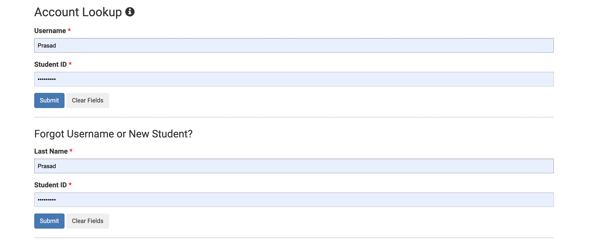
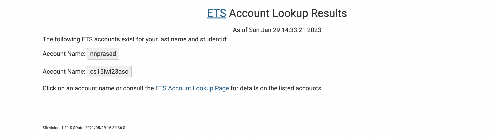
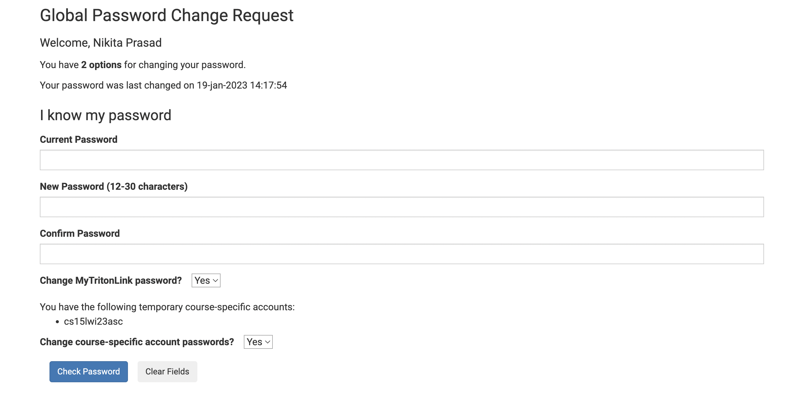
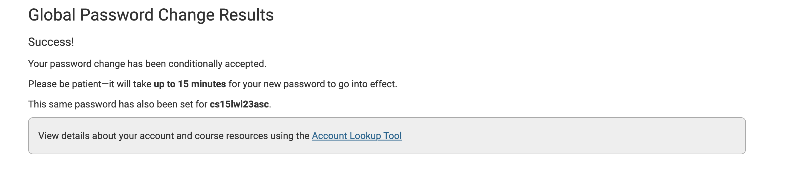
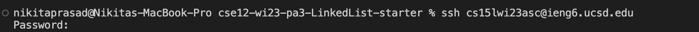
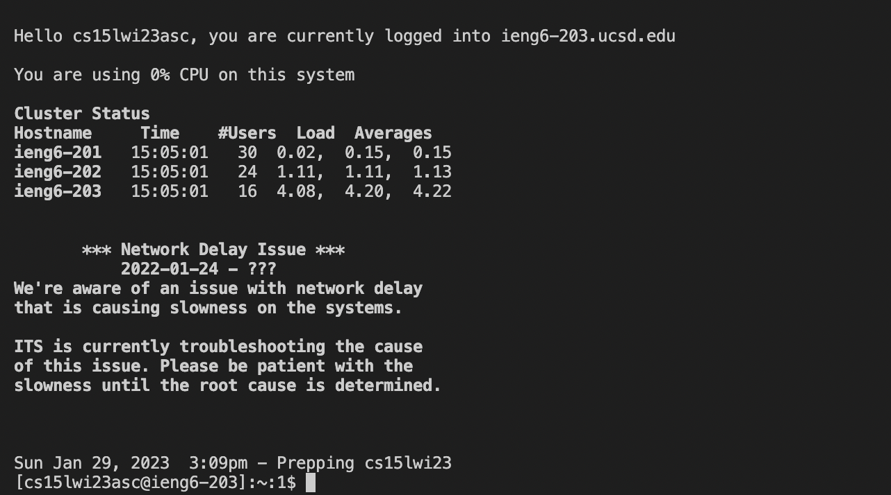
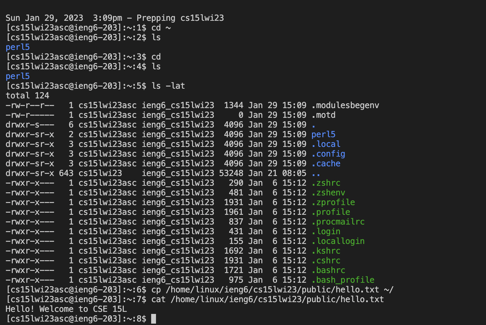

1. Go to the Visual Studio Code website https://code.visualstudio.com/, and follow the instructions to download and install it on your computer. I already had it installed on my computer. Fig 1 shows the version of VS code that I have downloaded. 

3. Log into your course-specific CSE 15L account at https://sdacs.ucsd.edu/~icc/index.php (Fig 1a). You can log in using either your last name or student id number. Obtain your account name as shown in Fig 2b.

*Fig 2a - logging into your account*

*Fig 2b - obtaining CSE 15L course-specific account details*

3. Reset your password by clicking on your CSE 15L course-specific account in Fig 2b, and then click on the “change password” option. Your screen should look like fig 3a. After the password change, your screen should look like fig 3b. 

*Fig 3a - screen when the “change password” option is clicked*

*Fig 3b - screen after changing the password* 

4. Open Terminal on VS code, and type the command below with your course-specific student account. An example of the same command with my account is shown below. 
**$ ssh cs15lwi23asc@ieng6.ucsd.edu**
After this, the password for your course-specific account should be typed in. Figure 4b shows what your screen should look like after that.

*Fig 4a - Connecting to the remote server*

*Fig 4b - screen on the terminal after typing in the password*
 
 5. Run a few commands on the terminal. Fig 5 shows some of the commands I ran. I wasn’t able to obtain anybody else’s course-specific student account number as I did not attend the first lab, so those commands are missing. 

*Fig 5 - Some commands I ran on the remote server*

