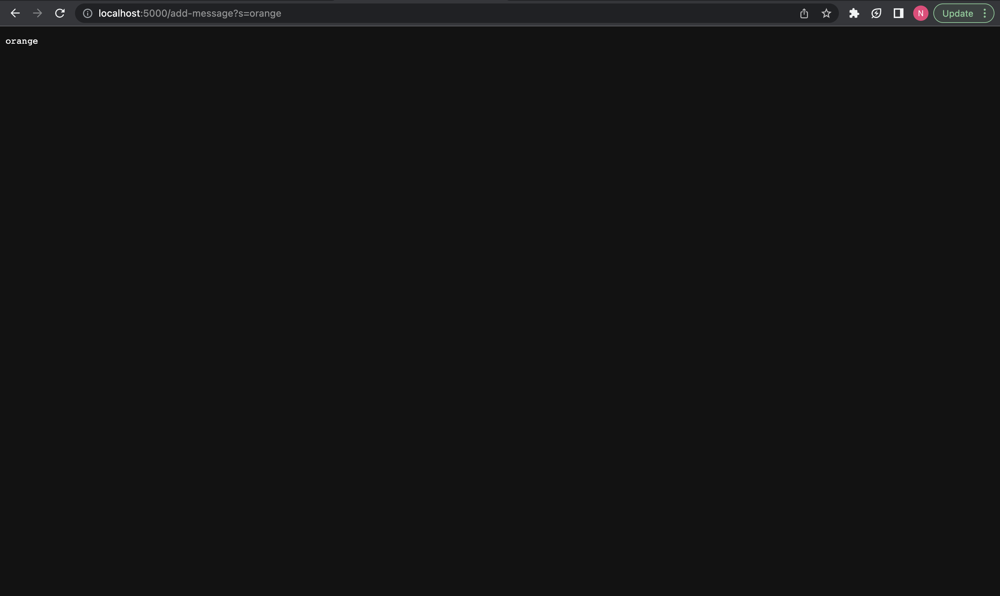
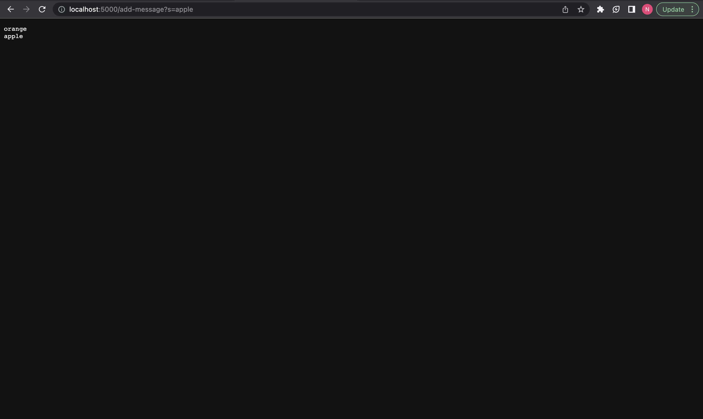
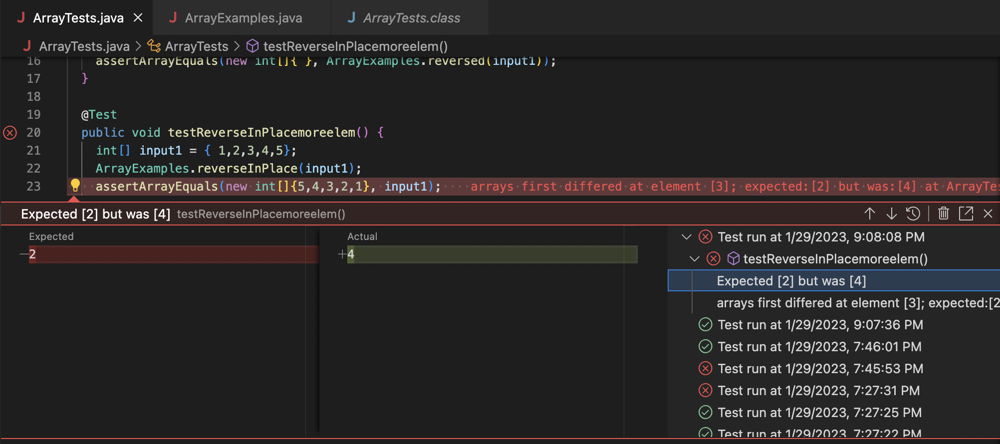
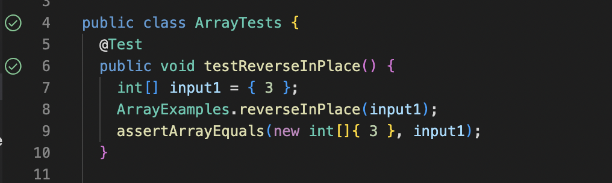

**PART 1**

* Code for program  

import java.io.IOException;  
import java.net.URI;  
import java.util.ArrayList;  

class Handler implements URLHandler {  
    ArrayList<String> requests = new ArrayList<String>();  

    public String handleRequest(URI url) {
        System.out.println("Path: " + url.getPath());
        if (url.getPath().contains("/add-message")) {
            String[] parameters = url.getQuery().split("=");
            if (parameters[0].equals("s")) {
                requests.add(parameters[1]);
                String listString = new String();
                for (String s : requests) {
                    listString += s + "\n";
                }
                return String.format(listString);
            }
            return "error!"; 
        }
        else {
            return "404 Not Found!";
        }
    }
}
class StringServer {
    public static void main(String[] args) throws IOException {
        if(args.length == 0){
            System.out.println("Missing port number! Try any number between 1024 to 49151");
            return;
        }

        int port = Integer.parseInt(args[0]);

        Server.start(port, new Handler());
    }
}
	
* Below are two screenshots of using /add-message

	
* Methods in code called: 
public static void main(String[] args) throws IOException is the first method that is called (during command "java StringServer port"). This method handles requests for /add?s=someString. In this case /add?s=orange
public String handleRequest(URI url) is the second method that is called. This method starts the server on a port in given in args[0].
	
* Relevant arguments to the methods: 
String [] args in the main method refers to system inputs (built in). In this case, it is the port number.
URI url refers to the localhost url. 

* Relevant fields of class:
Arraylist requests stores the query parameters in the url to concatenate on the page.
	
* Values in the relevant fields that changed:
requests changes from null to {orange}
	

* Methods in code called: 
Public static void main(String[] args) throws IOException is the first method that is called(during command "java StringServer port"). This method handles requests for /add?s=someString. In this case /add?s=apple
public String handleRequest(URI url) is the second method that is called. This method starts the server on a port in given in args[0].
	
* Relevant arguments to the methods: 
String [] args in the main method refers to system inputs (built in). In this case, it is the port number. 
URI url refers to the localhost url.

* Relevant fields of class:
Arraylist requests stores the query parameters in the url to concatenate on the page.
	
* Values in the relevant fields that changed:
requests changes from {orange} to {orange, apple}
	

**PART 2**

* A failure-inducing input from the buggy program as a J-unit test
Below is the code corresponding to a failed test for the buggy method reverseInPlace. 

@Test  
  //test for method reverseInPlace  
	public void testReverseInPlacemoreelem() {  
    int[] input1 = {1,2,3,4,5};  
    ArrayExamples.reverseInPlace(input1);  
    assertArrayEquals(new int[]{5,4,3,2,1}, input1);  
	}  
}  
  
* An input into the buggy program that doesn't induce a failure 
Below is the code corresonding to a passed test for the buggy method reverseInPlace

@Test  
  //test for method reverseInPlace  
	public void testReverseInPlace() {  
    int[] input1 = {3};  
    ArrayExamples.reverseInPlace(input1); 
    assertArrayEquals(new int[]{3}, input1); 
	} 
  
* The symptom as the output of running the tests
Below are screenshots of the result of running the two tests mentioned above on Junit 

Failed Junit test for method reverseInPlace

Passed Junit test for method reverseInPlace

* The bug, as the before-and-after code change required to fix it

Method reverseInPlace before the code change: 
static void reverseInPlace(int[] arr) { 
    for(int i = 0; i < arr.length; i += 1) { 
      arr[i] = arr[arr.length - i - 1]; 
    } 

Method reverseInPlace after the code change: 
  static void reverseInPlace(int[] arr) { 
    for(int i = 0; i < arr.length/2; i += 1) { 
      int copy;  
      copy = arr[i];  
      arr[i] = arr[arr.length - i - 1]; 
      arr[arr.length-i-1] = copy; 
    } 
  } 

* The bug was that the program only worked for the first half of the array. For the second half of the array, the program was just switching the elements back to the original place as first half of the array was modified. 
To fix this, I only looped through the first half of the array. I made a copy of the element at that index and transferred it to the reverse index. Similarly I transferred the element at the reverse index to the current index. 
	

**PART 3**
	
In the past two weeks I learnt how to write java testers (assertEquals method, @test). It is very interesting how the same code can fail during some tests and pass during some tests. Thus it is very important to cover as many possible test cases as possible in order to make sure that there are no/few bugs in your code. 

