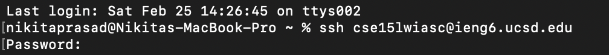
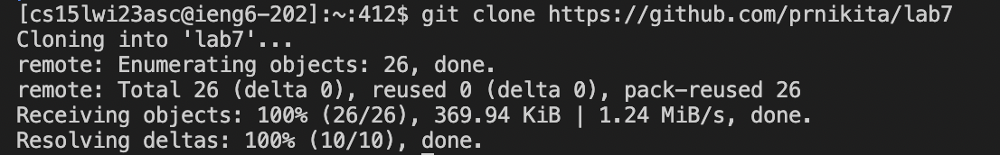
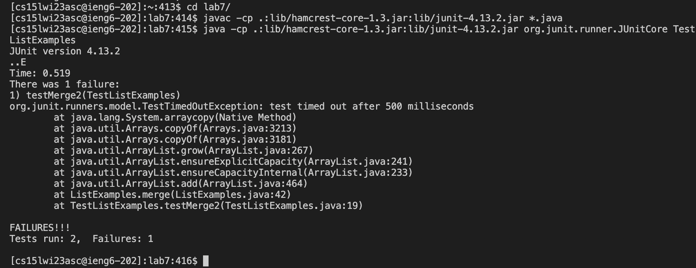
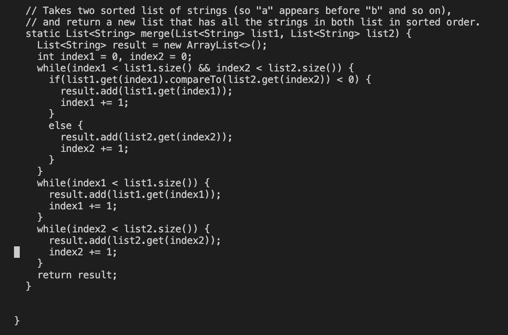
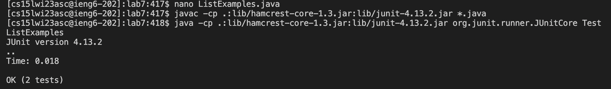
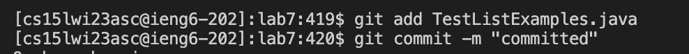

STEP 4 <br>
I held ```<CTRL>``` and R together on the keyboard to access my command history. Then I pressed 's' on the keyboard. The full ssh command appeared on the command line. Then I clicked ```<ENTER>``` <br>
KEYS PRESSED - ```<CTRL-R>``` -> s on command line -> ```<ENTER>```



STEP 5 <br>
I held ```<CTRL>``` and R together on the keyboard to access my command history. Then I pressed 'git cl' on the keyboard. The full git clone command appeared on the command line. Then I clicked ```<ENTER>``` <br>
KEYS PRESSED - ```<CTRL-R>``` -> git cl on command line -> ```<ENTER>```



STEP 6 <br>
Then I changed my directory to inside lab7 by typing "cd l" and ```<tab>```. Then I pressed the up arrow five times to access the javac command to compile all java files in directory. Then I pressed the up arrow four times to access the java command to run TestListExamples.java. <br>
KEYS PRESSED - cd l ```<tab> <ENTER>```->```<UP> <UP> <UP> <UP> <UP> <ENTER>```-> ```<UP> <UP> <UP> <UP> <UP> <ENTER>```


 
STEP 7 <br>
Then I typed nano L ```tab``` then filled '.java'. After accessing the file, I pressed ```<CTRL>```, ```<shift>```, and '-' key at the same time. Then I typed 42 to directly go to line 43 of the file. Then I used the right arrow keys to get ahead of the 1 in index1. Then I pressed ```<delete>``` and the 2 key. The I pressed ```<CTRL-O``` to save then ```<CTRL-X``` to exit. <br>
KEYS PRESSED - nano L .java ```<tab> <ENTER>``` ->  ```<CTRL>``` + ```<shift>``` + '-' '4' '3'-> ```<RIGHT>``` X 12 ```<DELETE>``` '2' -> ```<CTRL-O> <ENTER> <CTRL-X>```



STEP 8 <br>
Then I pressed the up arrow thrice to access the javac command, then thrice more to access the java command. <br>
KEYS PRESSED - ```<UP> <UP> <UP> <ENTER>``` -> ```<UP> <UP> <UP> <ENTER>``` 



STEP 9 <br>
I held ```<CTRL>``` and R together on the keyboard to access my command history. Then I pressed 'git a' on the keyboard. The full git add command appeared on the command line. Then I clicked ```<ENTER>```<br>
KEYS PRESSED - ```<CTRL-R>``` -> git a on command line -> ```<ENTER>```
I held ```<CTRL>``` and R together on the keyboard to access my command history. Then I pressed 'g' on the keyboard. The full git commit command appeared on the command line. Then I clicked ```<ENTER>```<br>
KEYS PRESSED - ```<CTRL-R>``` -> g on command line -> ```<ENTER>```


